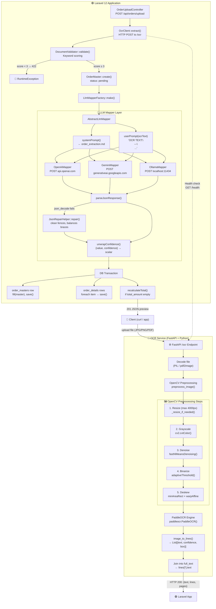

# OCR Implementation

## Architecture Overview



## Pipeline Walkthrough

### 1. File Upload
- **Endpoint:** `POST /ocr` on the FastAPI service (port 8000)
- **Accepted types:** `image/jpeg`, `image/png`, `image/webp`, `application/pdf`
- **Max size:** no hard limit at the OCR level (Laravel enforces 10 MB via `ExtractDocumentRequest`)

### 2. Image Decoding (`ocr-service/main.py:189-212`)
- Images → `PIL.Image.open()` → `numpy.ndarray`
- PDFs → `pdf2image.convert_from_bytes()` at 200 DPI → 1 `ndarray` per page
- Each page is processed independently; lines from all pages are merged with a `page` index

### 3. OpenCV Preprocessing (`main.py:preprocess_image()`, lines 93-136)
All steps are individually toggleable via environment variables:

| Step | Env Var (default) | Method | Effect |
|---|---|---|---|
| Resize | `PREPROCESS_MAX_SIZE` (4000) | `cv2.resize` with `INTER_AREA` | Prevents OOM on very large scans |
| Grayscale | `PREPROCESS_GRAYSCALE` (true) | `cv2.cvtColor(COLOR_BGR2GRAY)` | Reduces channels, improves detection |
| Denoise | `PREPROCESS_DENOISE` (true) | `cv2.fastNlMeansDenoising(h=30)` | Removes scanner noise/grain |
| Binarize | `PREPROCESS_BINARIZE` (true) | `cv2.adaptiveThreshold(Gaussian, 31, 2)` | Converts to clean black-on-white |
| Deskew | `PREPROCESS_DESKEW` (true) | `minAreaRect` → `warpAffine` | Corrects rotation up to ~5° |

To disable all preprocessing: `PREPROCESS_ENABLED=false`

### 4. PaddleOCR Engine (`main.py:142-168`)
- **Language:** default `japan` (`OCR_LANG` env var)
- **Model:** `PaddleOCR(use_angle_cls=True, lang=...)`
- Loaded lazily on first request; weights cached after initial download
- Each detection returns: `{text, confidence (float), box (4×2 coords)}`
- The raw OCR text = `"\n".join(line["text"] for line in all_lines)`

### 5. Document Validation (`app/Services/DocumentValidator.php`)
Scoring-based classifier that ensures the uploaded document is order-related:

- **Keywords (EN):** invoice, purchase order, total, amount, quantity, etc.
- **Keywords (JA):** 請求書, 納品書, 見積書, 合計金額, 得意先, etc.
- **Patterns:** currency amounts (`$100`, `¥1,000`), order codes (`INV-001`, `ORD-001`), dates, subtotal/total lines
- **Scoring:** keyword match = +1, pattern match = +2
- **Threshold:** default 3 (configurable via `DOCUMENT_VALIDATOR_MIN_SCORE`)
- **Failure:** throws `RuntimeException("The uploaded image doesn't appear to be a supported order image/document")`

### 6. LLM Mapper Layer

#### Shared prompt (`resources/prompts/order_extraction.md`)
- Editable Markdown file (not hardcoded in PHP)
- Contains: extraction rules, per-field schema (100+ fields), few-shot examples with Japanese invoice data
- All 3 providers load the same prompt via `AbstractLlmMapper::systemPrompt()`
- Confidence-aware output shape: `{"field": {"value": ..., "confidence": "high|medium|low"}}`

#### Providers (pluggable via `LlmMapperFactory`)
| Provider | Class | API | Model (default) |
|---|---|---|---|
| OpenAI | `OpenAiMapper.php` | `chat/completions` + `response_format: json_object` | `gpt-4o-mini` |
| Gemini | `GeminiMapper.php` | `generateContent` + `responseMimeType: application/json` | `gemini-2.5-flash` |
| Ollama | `OllamaMapper.php` | `/api/chat` + `format: json` | `llama3.1` |

All use `temperature=0` for deterministic extractions.

#### JSON Repair (`JsonRepairHelper.php`)
Applied automatically when `json_decode()` fails:
1. Strips markdown code fences (```` ```json ```` / ```` ``` ````)
2. Removes trailing commas in objects/arrays
3. Wraps single-quoted keys/values in double quotes
4. Balances unclosed `{` / `[` braces/brackets

#### Confidence Unwrapping (`AbstractLlmMapper::unwrapConfidence()`)
If the LLM response uses the `{value, confidence}` wrapper shape, the mapper:
1. Flattens all `{value, confidence}` leaves back to plain scalars
2. Extracts `field_confidence` (dot-path → level map)
3. Records `low_confidence_fields` (dot-paths at or below the review threshold)
4. Sets `order_masters.status = 'flagged'` when any low-confidence fields exist

### 7. Persistence (`OrderIngestionService.php`)
- **File stored** in `storage/app/private/order-uploads/`
- `OrderMaster` created with `status = 'pending'` (or `'flagged'` if low confidence)
- `OrderDetail` rows created from `items[]`
- `total_amount` auto-calculated via `recalculateTotal()` if LLM didn't supply it
- On **failure:** status set to `'failed'`, error saved in `notes`, raw OCR text preserved for debugging

### 8. Human Review API
All orders start as `pending` so a human can review before confirming:

| Method | Endpoint | Purpose |
|---|---|---|
| `GET` | `/api/orders` | List all orders |
| `GET` | `/api/orders/{id}` | View order + line items |
| `PATCH` | `/api/orders/{id}` | Fix header fields (vendor, date, etc.) |
| `POST` | `/api/orders/{id}/items` | Add a missed line item |
| `PATCH` | `/api/orders/{id}/items/{item}` | Correct a misread item |
| `DELETE` | `/api/orders/{id}/items/{item}` | Remove hallucinated item |
| `POST` | `/api/orders/{id}/recalculate-total` | Re-sum from items |
| `POST` | `/api/orders/{id}/confirm` | Finalize (status → `confirmed`) |
| `POST` | `/api/orders/{id}/reopen` | Revert confirmed → pending |

## Key Design Decisions

1. **Stateless OCR service** — the Python/FastAPI service knows nothing about orders or database schemas. It only turns pixels into text, making it reusable for other features.
2. **Prompt as configuration** — extraction rules live in a Markdown file, not code. Tweak behaviour by editing the prompt, adding few-shot examples, or swapping the prompt file per document type (`LLM_PROMPT_PATH`).
3. **Pluggable LLM providers** — all implement `LlmMapperInterface`; switch via `LLM_PROVIDER` env var or per-request `llm_provider` field.
4. **Confidence awareness** — the prompt instructs the LLM to tag each field with a confidence level; low-confidence fields automatically flag the order for human review.
5. **Defensive JSON parsing** — LLMs occasionally emit malformed JSON; `JsonRepairHelper` cleans common issues before falling back to an error.
6. **Preview-before-persist** — the web dashboard (`DocumentExtractionController`) bypasses the database entirely, returning the OCR text + parsed JSON for review without saving anything.

## Environment Configuration

```ini
# OCR Service
OCR_SERVICE_URL=http://localhost:8000
OCR_SERVICE_TIMEOUT=60

# LLM Provider
LLM_PROVIDER=openai
OPENAI_API_KEY=sk-...
OPENAI_MODEL=gpt-4o-mini
GEMINI_API_KEY=...
OLLAMA_BASE_URL=http://localhost:11434
LLM_PROMPT_PATH=resources/prompts/order_extraction.md

# Document Validation
DOCUMENT_VALIDATOR_MIN_SCORE=3
```

## Testing

```bash
# Full pipeline test (mocks OCR + LLM)
cd laravel-app && php artisan test --filter=OrderUploadTest

# Editing/correction workflow test
php artisan test --filter=OrderEditingTest

# Extraction dashboard test
php artisan test --filter=DocumentExtractionTest
```
