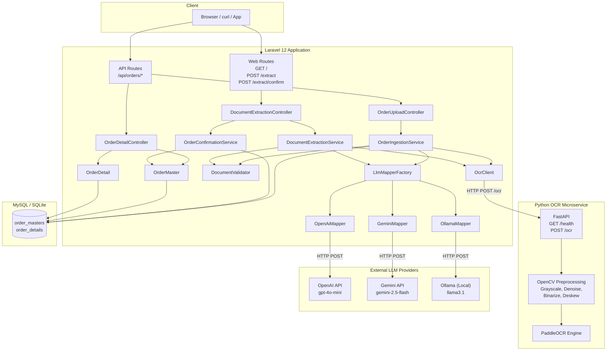
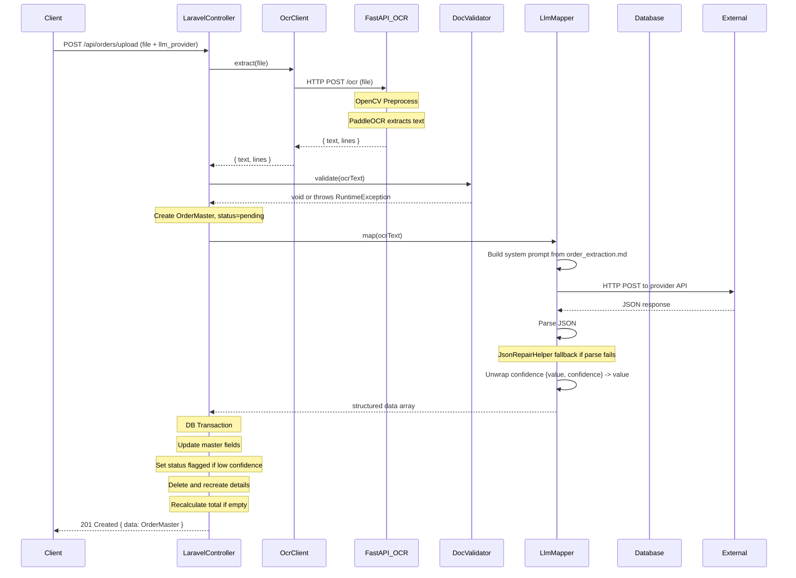
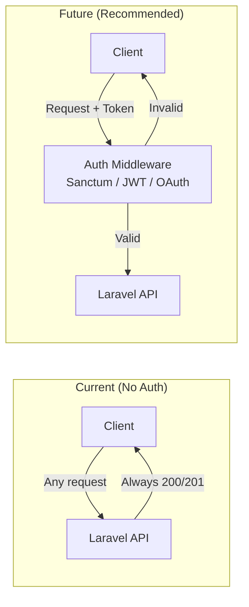
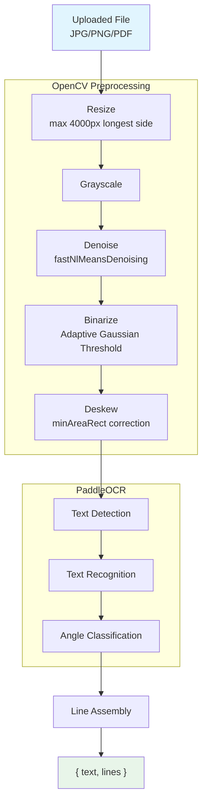
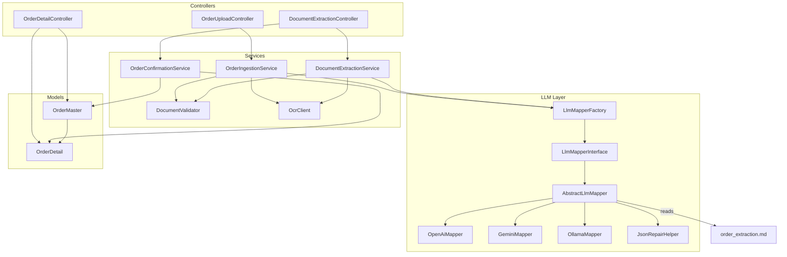

# System Architecture

## Overview

OCR Order Ingestion is a two-service system that converts scanned invoices/purchase orders into structured database records. It consists of a **FastAPI OCR microservice** (Python) and a **Laravel 12 API** (PHP) connected via HTTP.

## Request Lifecycle (Upload Flow)

## Authentication Flow

The current implementation has **no authentication layer** — all endpoints are wide open. The system is designed to add auth later.

## OCR Pipeline

## Service Interactions

## Key Design Decisions

1. **Stateless OCR Service**: The FastAPI service knows nothing about orders — it only converts pixels to text. This allows reuse by other consumers.

2. **Pluggable LLM Providers**: All three providers (OpenAI, Gemini, Ollama) implement the same `LlmMapperInterface` and share one prompt file, making provider swaps config-free.

3. **Confidence-Aware Extraction**: Each field can include `{value, confidence}` — unwrapped transparently by `AbstractLlmMapper::unwrapConfidence()` so downstream code never sees the wrapper shape.

4. **Editable Prompt**: The extraction schema and few-shot examples live in a Markdown file (`order_extraction.md`), not hardcoded PHP — tune behavior without touching code.

5. **Human-in-the-Loop Workflow**: Upload → preview → edit → confirm. Orders start as `pending` (or `flagged` if low confidence), can be edited, and only become `confirmed` after human review.
