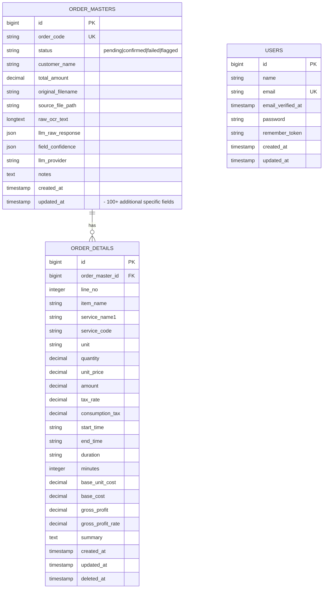
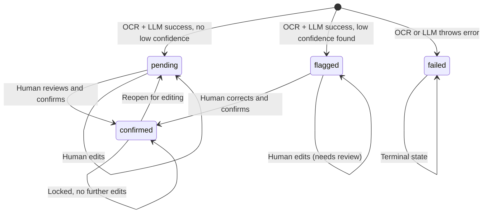

# Database Schema

## Entity Relationship Diagram

## Order Status Flow

## Tables

### `order_masters`

The master order header — stores everything about an order from OCR extraction through human confirmation. Contains ~150 columns covering:

- **Identification**: `id`, `order_code`, `quotation_number`, `branch_number`
- **Order Status**: `status` (pending/confirmed/failed/flagged), timestamps for each workflow step
- **Customer Info**: `customer_name`, `customer_code`, address fields (zip, prefecture, address1-3)
- **Billing**: `billing_code`, `billing_name`, `payment_terms`, `payment_conditions`
- **Staff**: `staff_code`, `staff_name`, `handling_office`, `handling_staff_name`
- **Service Details**: `service_classification`, `service_location`, `planned_service_date`, `service_type`
- **Time Fields**: Extensive start/end time fields, duration fields, housework/outdoor times
- **Financials**: `total_amount`, `total_base_cost`, `total_gross_profit`, `total_consumption_tax`, `advance_payment`, `transportation_cost`
- **Booleans**: `same_day_request`, `is_bathing`, `is_english_a`, `is_outdoor`, etc.
- **OCR/LLM Trail**: `raw_ocr_text`, `llm_raw_response` (JSON), `field_confidence` (JSON), `llm_provider`
- **Files**: `source_file_path`, `original_filename`
- **Timestamps**: `created_at`, `updated_at`

**Status column** uses string values (not enum) for flexibility:
- `pending` — auto-created preview, awaiting human review
- `confirmed` — reviewed and accepted, locked
- `failed` — OCR or LLM error occurred
- `flagged` — extraction succeeded but low-confidence fields need human review

### `order_details`

Line items belonging to an order. Supports both item-style and service-style entries.

| Column | Type | Description |
|--------|------|-------------|
| `id` | bigint PK | Auto-increment |
| `order_master_id` | bigint FK | References `order_masters.id` (cascade delete) |
| `line_no` | int | Line number (1-indexed) |
| `item_name` | string | Generic item name |
| `item_code` | string | Generic item code |
| `service_name1` | string | Service name (primary) |
| `service_name2` | string | Service name (secondary) |
| `service_code` | string | Service code |
| `unit` | string | Unit of measure (時間, 個, 回, pcs, etc.) |
| `quantity` | decimal(15,2) | Quantity |
| `unit_price` | decimal(15,2) | Unit price |
| `amount` | decimal(15,2) | Line total |
| `tax_rate` | decimal(5,2) | Tax rate |
| `tax_classification` | string | Tax classification |
| `consumption_tax` | decimal(15,2) | Consumption tax |
| `base_unit_cost` | decimal(15,2) | Base unit cost |
| `base_cost` | decimal(15,2) | Base cost |
| `gross_profit` | decimal(15,2) | Gross profit |
| `gross_profit_rate` | decimal(5,2) | Gross profit rate |
| `start_time` | time | Service start time |
| `end_time` | time | Service end time |
| `duration` | time | Duration |
| `minutes` | int | Duration in minutes |
| `summary` | text | Notes |
| `deleted_at` | timestamp | Soft delete support |

## Migration History

| Migration | Description |
|-----------|-------------|
| `0001_01_01_000000` | Create users table |
| `0001_01_01_000001` | Create cache table |
| `0001_01_01_000002` | Create jobs table |
| `2026_07_09_000001` | Create `order_masters` table (all main columns) |
| `2026_07_09_000002` | Create `order_details` table with FK to `order_masters` |
| `2026_07_20_000001` | Add `field_confidence` JSON column to `order_masters` |
| `2026_07_22_062030` | Remove `quotation_number` from both tables, cleanup |
| `2026_07_23_044924` | Add `tax_rate` column to `order_details` |
