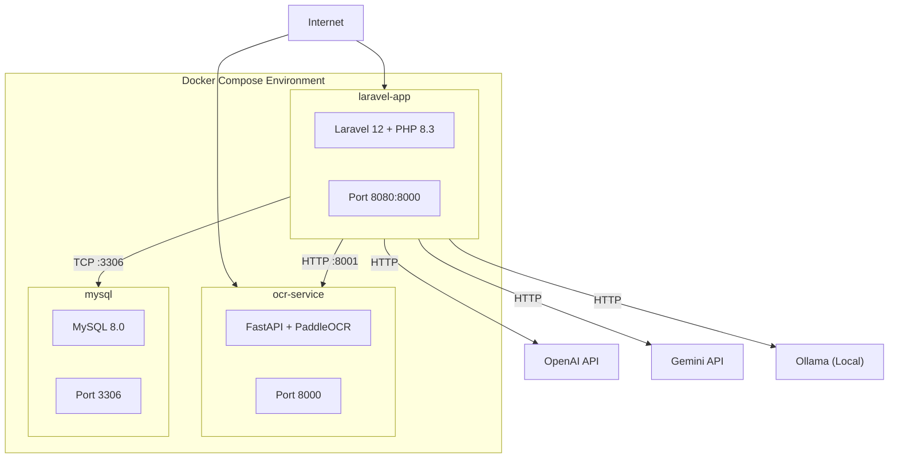
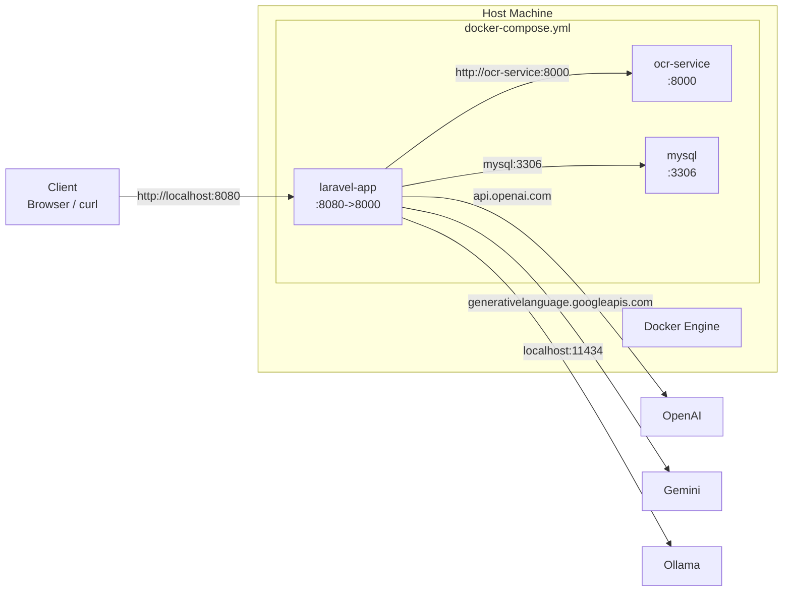

# Deployment Guide

## Architecture Overview (Deployment View)



## Prerequisites

- Docker & Docker Compose
- OR: PHP 8.3+, Python 3.10+, Composer
- Internet access (for `packagist.org`, Docker images, LLM APIs)

---

## Option 1: Docker Compose (Recommended)

### 1. Clone and Configure

```bash
git clone <repo-url> ocr-order-project
cd ocr-order-project
```

### 2. Environment Configuration

Edit `laravel-app/.env` with your LLM API keys:

```ini
# LLM Provider (openai | gemini | ollama)
LLM_PROVIDER=openai
OPENAI_API_KEY=sk-your-key-here

# For Gemini:
# LLM_PROVIDER=gemini
# GEMINI_API_KEY=your-key-here

# For Ollama:
# LLM_PROVIDER=ollama
# OLLAMA_BASE_URL=http://host.docker.internal:11434
```

### 3. Build and Start

```bash
docker compose up --build
```

This starts:
| Service | Container Name | Port |
|---------|---------------|------|
| OCR Service | `ocr-service` | `8000` |
| MySQL | `ocr-order-mysql` | `3306` |
| Laravel App | `laravel-app` | `8080` |

The Laravel container runs migrations on startup automatically.

### 4. Verify

```bash
# Check OCR service health
curl http://localhost:8000/health

# Test upload
curl -X POST http://localhost:8080/api/orders/upload \
  -F "file=@/path/to/invoice.jpg" \
  -F "llm_provider=openai"
```

### Docker Compose Configuration

From `docker-compose.yml`:

```yaml
services:
  ocr-service:
    build: ./ocr-service
    ports: ["8000:8000"]
    environment:
      PREPROCESS_ENABLED: "true"
      PREPROCESS_MAX_SIZE: "4000"

  mysql:
    image: mysql:8.0
    environment:
      MYSQL_DATABASE: ocr_orders
      MYSQL_ROOT_PASSWORD: root

  laravel-app:
    build: ./laravel-app
    ports: ["8080:8000"]
    depends_on: [mysql, ocr-service]
    environment:
      OCR_SERVICE_URL: http://ocr-service:8000
      DB_CONNECTION: mysql
      DB_HOST: mysql
```

---

## Option 2: Manual Setup

### OCR Service (Python)

```bash
cd ocr-service
python3 -m venv venv
source venv/bin/activate  # Windows: .\venv\Scripts\activate
pip install -r requirements.txt
uvicorn main:app --reload --port 8000
```

### Laravel App (PHP)

```bash
cd laravel-app
composer install
cp .env.example .env
# Edit .env with your settings
php artisan key:generate
php artisan migrate
php artisan serve --port=8000
```

Or for SQLite (simpler):
```ini
DB_CONNECTION=sqlite
# Then: touch database/database.sqlite && php artisan migrate
```

---

## Network Diagram



---

## Production Considerations

### Security Checklist

- [ ] **Add authentication** — Every endpoint is currently wide open. Add Laravel Sanctum, JWT, or OAuth before public exposure.
- [ ] **Rate limiting** — Apply to upload endpoints (`throttle:api` middleware).
- [ ] **HTTPS** — Use a reverse proxy (Nginx, Caddy, Traefik) with TLS termination.
- [ ] **Secrets management** — Use Docker secrets or a vault for API keys, not plain `.env` files.
- [ ] **File upload scanning** — Scan uploaded files for malware before OCR processing.

### Performance

- **PaddleOCR model caching**: First request downloads ~300MB of model weights. Ensure persistent storage for the model cache.
- **OCR timeouts**: PaddleOCR can take 5-30s per page. Set appropriate timeouts in `OcrClient`.
- **LLM timeouts**: OpenAI/Gemini typically respond in 2-10s. Ollama (local) may take 30-120s.
- **Database**: MySQL is recommended for production. SQLite is fine for development only.

### Scalability

- **OCR service**: Stateless — can be horizontally scaled behind a load balancer.
- **Laravel**: Stateless — scale horizontally behind a load balancer. Use Redis for sessions/cache.
- **Queue**: Consider queueing OCR/LLM jobs for async processing in production.

### Monitoring

- OCR service health: `GET /health` endpoint
- Laravel: Standard Laravel logging to `storage/logs/`
- Key metrics to monitor:
  - OCR success/failure rate
  - LLM response time per provider
  - Document validation pass/fail rate
  - Order creation rate

### Environment Variables Reference

| Variable | Default | Service | Description |
|----------|---------|---------|-------------|
| `OCR_SERVICE_URL` | `http://localhost:8001` | Laravel | FastAPI OCR endpoint |
| `OCR_SERVICE_TIMEOUT` | `60` | Laravel | OCR request timeout (s) |
| `LLM_PROVIDER` | `openai` | Laravel | Default LLM provider |
| `OPENAI_API_KEY` | — | Laravel | OpenAI API key |
| `OPENAI_MODEL` | `gpt-4o-mini` | Laravel | OpenAI model |
| `GEMINI_API_KEY` | — | Laravel | Gemini API key |
| `GEMINI_MODEL` | `gemini-2.5-flash` | Laravel | Gemini model |
| `OLLAMA_BASE_URL` | `http://localhost:11434` | Laravel | Ollama endpoint |
| `OLLAMA_MODEL` | `llama3.1` | Laravel | Ollama model |
| `LLM_REVIEW_THRESHOLD` | `low` | Laravel | Confidence review threshold |
| `DOCUMENT_VALIDATOR_MIN_SCORE` | `3` | Laravel | Min keyword score |
| `PREPROCESS_ENABLED` | `true` | OCR | OpenCV preprocessing toggle |
| `PREPROCESS_MAX_SIZE` | `4000` | OCR | Max image dimension (px) |
| `OCR_LANG` | `japan` | OCR | PaddleOCR language |
| `DB_CONNECTION` | `sqlite` | Laravel | Database driver |
