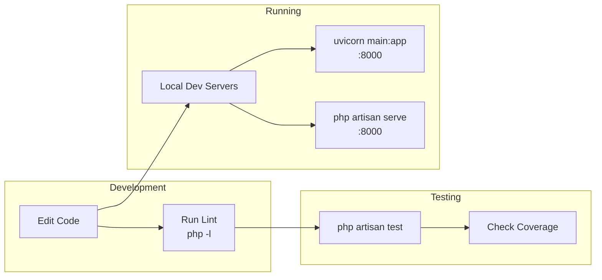

# Development Guide

## Development Workflow



## Prerequisites

- **PHP 8.3+** with extensions: `pdo`, `pdo_mysql`, `pdo_sqlite`, `zip`, `mbstring`
- **Composer 2.x**
- **Python 3.10+**
- **Node.js** (for Laravel Vite, optional for backend-only work)
- **Docker** (optional, for containerized runs)

---

## Getting Started

### 1. OCR Service

```bash
cd ocr-service
python -m venv venv
# Windows:
.\venv\Scripts\activate
# macOS/Linux:
# source venv/bin/activate

pip install -r requirements.txt
uvicorn main:app --reload --port 8000
```

The first request will download PaddleOCR model weights (~300MB).

### 2. Laravel App

```bash
cd laravel-app
composer install
cp .env.example .env
# Edit .env (see below)
php artisan key:generate
php artisan migrate
php artisan serve --port=8000
```

### 3. Environment Setup

Minimal `.env` for local development:

```ini
APP_ENV=local
APP_DEBUG=true
DB_CONNECTION=sqlite

OCR_SERVICE_URL=http://localhost:8000
LLM_PROVIDER=openai
OPENAI_API_KEY=sk-your-key-here
# Or for testing without API calls, use mock responses
```

For SQLite:
```bash
# Windows:
New-Item -Path database/database.sqlite -ItemType File
# macOS/Linux:
# touch database/database.sqlite
```

---

## Testing

### Running Tests

```bash
cd laravel-app
php artisan test
```

Or run a specific test file:
```bash
php artisan test --filter=OrderUploadTest
php artisan test --filter=DocumentExtractionTest
```

### Test Architecture

Tests use Laravel's `RefreshDatabase` trait and `Http::fake()` to mock external services:

```php
// Mock OCR service
Http::fake([
    'localhost:8001/ocr' => Http::response([
        'text' => 'Invoice #INV-2001\nTotal: 20.00',
        'lines' => [],
    ], 200),
]);

// Mock LLM provider
Http::fake([
    'api.openai.com/*' => Http::response([
        'choices' => [['message' => ['content' => '{"master":{...},"items":[...]}']]],
    ], 200),
]);
```

### Test Files

| Test File | Coverage |
|-----------|----------|
| `OrderUploadTest.php` | Upload pipeline: validation, OCR, LLM, DB persistence |
| `OrderEditingTest.php` | Edit master, add/edit/delete items, recalculate, confirm/reopen |
| `DocumentExtractionTest.php` | Dashboard: validation, extraction, JSON repair, missing fields |
| `ExtractionConfirmationTest.php` | Confirm endpoint: persist, preserve confidence, reject invalid |
| `ConfidenceExtractionTest.php` | Confidence unwrapping, flagging, backward compatibility |

---

## Common Development Tasks

### Adding a New LLM Provider

1. Create a new mapper class extending `AbstractLlmMapper`:
```php
namespace App\Services\Llm;

class NewProviderMapper extends AbstractLlmMapper
{
    public function providerName(): string { return 'newprovider'; }

    public function map(string $ocrText): array
    {
        // Call new provider API
        // Return $this->parseJsonResponse($response);
    }
}
```
2. Add the case to `LlmMapperFactory::make()`
3. Add config in `config/services.php`
4. Add env vars in `.env.example`

### Modifying the Extraction Prompt

Edit `resources/prompts/order_extraction.md` to:
- Add few-shot examples for new document layouts
- Tighten/loosen field extraction rules
- Add new fields to the JSON schema
- Change confidence rules

No PHP code changes needed — the prompt is loaded dynamically by `AbstractLlmMapper::systemPrompt()`.

### Adding a New Field to the Schema

1. Add the column to the database migration for `order_masters` or `order_details`
2. Add the field to the `$fillable` array in the model
3. Add the cast in the model (if needed)
4. Add the field definition in `resources/prompts/order_extraction.md`
5. Run `php artisan migrate`

### Confidence-Aware Extraction

The LLM should return fields wrapped in `{value, confidence}`:
```json
{
    "master": {
        "customer_name": {
            "value": "Acme Supplies",
            "confidence": "high"
        },
        "total_amount": {
            "value": null,
            "confidence": "low"
        }
    },
    "items": [...]
}
```

The `AbstractLlmMapper::unwrapConfidence()` method:
1. Detects the wrapper shape automatically
2. Flattens to plain values for downstream code
3. Builds `field_confidence` map (dot-path → confidence)
4. Builds `low_confidence_fields` list (fields at/below threshold)
5. Sets `status = 'flagged'` when any low-confidence field exists

Backward compatible: flat responses (without wrappers) work unchanged.

---

## Architecture Decisions

### Why FastAPI + PaddleOCR instead of a PHP OCR library?
PHP has limited native OCR support. Python's PaddleOCR is a state-of-the-art text recognition engine with built-in language support (Japanese, Chinese, English, etc.). The FastAPI service is intentionally stateless — it only converts pixels to text, making it reusable.

### Why OpenCV preprocessing?
Scanned documents often have noise, skew, and poor contrast. PaddleOCR's accuracy improves significantly with clean, properly oriented input. Each preprocessing step is independently toggleable via environment variables.

### Why a pluggable LLM layer?
Different use cases benefit from different models: OpenAI for cloud-based reliability, Gemini for cost-sensitive workloads, Ollama for air-gapped/private deployments. The shared prompt and interface ensure consistent behavior regardless of provider.

### Why a 3-bucket confidence system?
LLMs self-assess coarse categories (`high`/`medium`/`low`) more reliably than calibrated 0-1 probabilities. The threshold is configurable.

### Why no authentication in the scaffold?
The project is intentionally kept simple for demonstration. Auth is a cross-cutting concern best added with the team's standard approach (Sanctum, JWT, etc.).
