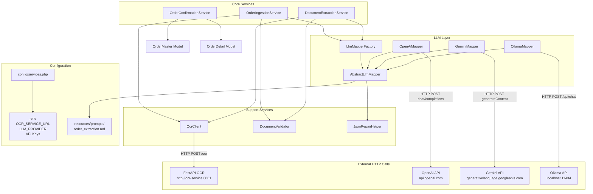

# Service Layer Documentation

## Service Interaction Diagram



---

## Service Descriptions

### `OcrClient` — `app/Services/OcrClient.php`

HTTP client for the FastAPI OCR microservice.

**Dependencies**: `Illuminate\Support\Facades\Http`

**Methods**:
| Method | Returns | Description |
|--------|---------|-------------|
| `extract(UploadedFile $file)` | `array{text: string, lines: array}` | Sends file to `/ocr` endpoint |
| `healthCheck()` | `bool` | Pings `/health` endpoint |

**Configuration** (from `config/services.php`):
- `ocr.base_url` — OCR service URL (env: `OCR_SERVICE_URL`, default: `http://localhost:8001`)
- `ocr.timeout` — Request timeout in seconds (env: `OCR_SERVICE_TIMEOUT`, default: `60`)

---

### `DocumentValidator` — `app/Services/DocumentValidator.php`

Rule-based validator that scores OCR text against order-related keywords and patterns to determine if the document is an order/invoice.

**Scoring**:
- Each keyword match = +1 point
- Each pattern match (regex) = +2 points
- Minimum threshold: 3 (configurable via `DOCUMENT_VALIDATOR_MIN_SCORE`)

**Keywords** (English): invoice, purchase order, receipt, bill, quotation, total, customer, vendor, amount, price, quantity, unit price, etc.

**Keywords** (Japanese): 請求書, 納品書, 見積書, 注文書, 領収書, 合計金額, 消費税, 伝票番号, 時間, 個, 回, 等.

**Patterns**: Currency amounts (`$100`, `¥1,000`), order numbers (`INV-001`, `ORD-001`, `PO-123`), dates (`2026-07-09`), quantity patterns (`2 x 10`), total/subtotal lines.

**Throws**: `RuntimeException` when score < threshold.

---

### `OrderIngestionService` — `app/Services/OrderIngestionService.php`

Orchestrates the full ingestion pipeline for the API endpoint (`POST /api/orders/upload`).

**Flow**:
1. Store uploaded file in private storage (`storage/app/private/order-uploads/`)
2. Call `OcrClient::extract()` for OCR text
3. Call `DocumentValidator::validate()` to confirm it's an order document
4. Create `OrderMaster` with `status = 'pending'`
5. Call LLM mapper via `LlmMapperFactory::make()` to get structured data
6. In a DB transaction:
   - Fill master fields from LLM response
   - Set `field_confidence` JSON column
   - Set `status` to `'flagged'` if low-confidence fields exist
   - Delete existing details, recreate from LLM items
   - Recalculate `total_amount` if empty
7. On any exception: set order status to `'failed'` and save error in `notes`

---

### `DocumentExtractionService` — `app/Services/DocumentExtractionService.php`

Orchestrates extraction for the web dashboard (`POST /extract`). Does NOT persist to database.

**Flow**:
1. Store file in public storage (`storage/app/public/temp/`)
2. Generate preview URL
3. Call `OcrClient::extract()` for OCR text
4. Call `DocumentValidator::validate()` to confirm it's an order document
5. Call LLM mapper via `LlmMapperFactory::make()` to get structured data
6. Audit missing required fields
7. Return payload with `preview_url`, `raw_ocr_text`, `extracted_data`, `missing_fields`, `field_confidence`, `low_confidence_fields`

---

### `OrderConfirmationService` — `app/Services/OrderConfirmationService.php`

Persists a reviewed (possibly human-edited) extraction payload from the dashboard.

**Flow**:
1. In a DB transaction:
   - Create new `OrderMaster` with filled master data
   - Set `field_confidence` from original extraction
   - Set `status = 'confirmed'`
   - Create `OrderDetail` rows for each item
   - Recalculate `total_amount` if empty

**Key difference from `OrderIngestionService`**: Does NOT call OCR or LLM — saves the data the dashboard already has after human review.

---

## LLM Layer

### `LlmMapperInterface` — `app/Services/Llm/LlmMapperInterface.php`

```php
interface LlmMapperInterface {
    public function map(string $ocrText): array;
    public function providerName(): string;
}
```

Expected return shape:
```php
[
    'master' => ['customer_name' => ?string, 'total_amount' => ?float, ...],
    'items' => [['item_name' => string, 'quantity' => float, ...], ...],
    'field_confidence' => ['master.customer_name' => 'high', ...],
    'low_confidence_fields' => ['master.customer_name', ...],
]
```

### `LlmMapperFactory` — `app/Services/Llm/LlmMapperFactory.php`

Creates the appropriate LLM mapper based on provider name.

```php
LlmMapperFactory::make('openai')   // -> OpenAiMapper
LlmMapperFactory::make('gemini')   // -> GeminiMapper
LlmMapperFactory::make('ollama')   // -> OllamaMapper
LlmMapperFactory::make(null)       // -> uses config('services.llm.default')
```

### `AbstractLlmMapper` — `app/Services/Llm/AbstractLlmMapper.php`

Base class with shared logic:

1. **`systemPrompt()`** — Loads prompt from `resources/prompts/order_extraction.md` (cached in-memory per request)
2. **`userPrompt(string $ocrText)`** — Wraps OCR text in a simple user message
3. **`parseJsonResponse(string $raw)`** — Core parsing pipeline:
   - Strips markdown code fences
   - Attempts `json_decode()`
   - Falls back to `JsonRepairHelper::repair()` if initial parse fails
   - Calls `unwrapConfidence()` to detect and flatten `{value, confidence}` wrappers
   - Merges defaults for master and item fields

4. **`unwrapConfidence(array $decoded)`** — Confidence-aware extraction:
   - Detects `{value, confidence}` wrapper shape
   - Recursively flattens to plain values
   - Builds `field_confidence` map (dot-path → confidence level)
   - Builds `low_confidence_fields` list (at or below `services.llm.review_threshold`)

### `OpenAiMapper` — `app/Services/Llm/OpenAiMapper.php`

Calls OpenAI `chat/completions` endpoint.

- Model: `gpt-4o-mini` (configurable)
- Uses `response_format: json_object` for reliable JSON output
- Temperature: 0

### `GeminiMapper` — `app/Services/Llm/GeminiMapper.php`

Calls Gemini `generateContent` endpoint.

- Model: `gemini-2.5-flash` (configurable)
- Uses `responseMimeType: application/json`
- Temperature: 0

### `OllamaMapper` — `app/Services/Llm/OllamaMapper.php`

Calls local Ollama `/api/chat` endpoint.

- Model: `llama3.1` (configurable)
- Uses `format: json`
- Temperature: 0
- Timeout: 120s (longer for local models)

### `JsonRepairHelper` — `app/Services/Llm/JsonRepairHelper.php`

Static helper to repair malformed JSON from LLM responses:

1. Strips markdown code fences (```json ... ```)
2. Removes trailing commas in objects/arrays
3. Balances missing closing braces/brackets
4. Replaces single quotes with double quotes around keys and string values
